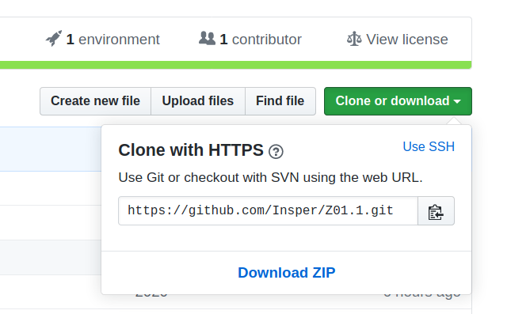
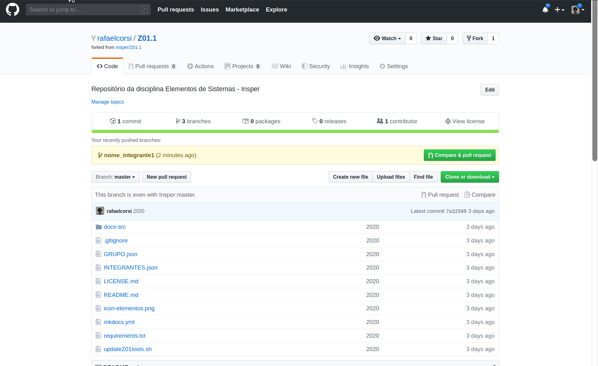
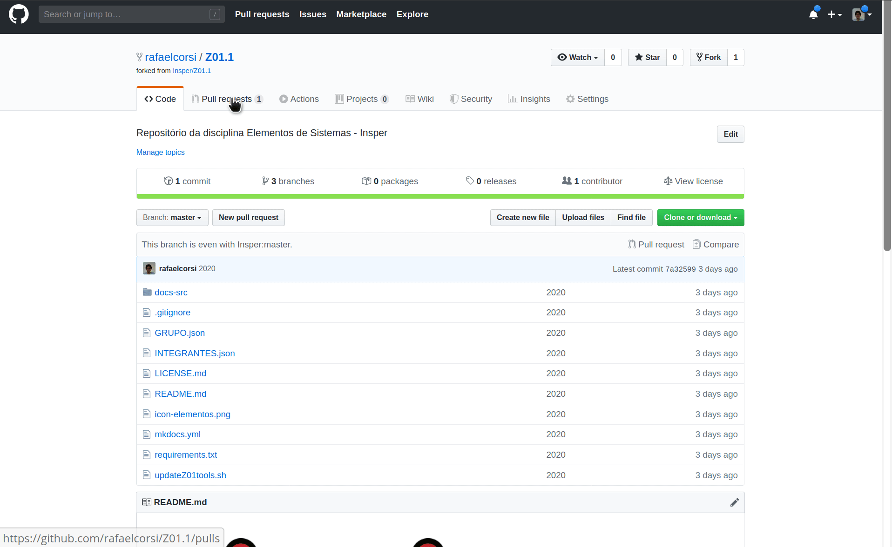

# Lab 2: Github

Nesse laboratório iremos trabalhar com o uso do git de forma colaborativa.

> Aconselhável fazer no Linux, mas pode fazer no Windows (precisa ter git instalado).

## Clonando

!!! warning "Individual"
    Todos do grupo devem realizar de maneira individual!

Uma vez criado o **fork**  e adicionado os colegas como contribuidores do projeto (feito no lab 1) vocês deverão clonar o repositório para o computador de vocês com o comando:

``` bash
$ git clone $URL_DO_FORK
```

!!! note "$URL_DO_FORK"
    A URL do seu fork pode ser obtida pelo botão 'Clone or Download' do github
    
    {width=500}
    
    ==Note que a url exibida é do repositório base da disciplina, vocês
    devem clonar o repositório que foi criado no Lab 1==
    
!!! linux 
    O símbolo `$` indica que é um comando para ser executado no 
    terminal do Linux (`bash`), mas ele não deve fazer parte do comando.
    No caso anterior, o comando a ser colado deve ser: `git clone URL_DO_FORK`.
    
!!! Linux
    Para abrir o terminal: `meta`+`t` 

<button class="button0" id="0:clonando" onClick="progressBut(this.id);">Cheguei Aqui!</button> 


## Adicionando nomes ao `INTEGRANTES.json`

!!! warning "Individual"
    Deve ser realizado individual por todos do grupo.

!!! tip
    Antes de começar, atualize seu repositório com o remoto
    
    ```bash
    $ git pull origin main
    ```
    
Nesse etapa cada integrante do grupo irá editar um arquivo no seu computador e realizar um pull-request para o repositório do grupo. Para isso seguiremos as etapas a seguir:

1. Gerar mudanças no repositório local
1. Criando um branch com as mudanças 
1. Enviar mudanças para o repositório remoto
1. Gerar pull-request

### `INTEGRANTES.json`

**Cada integrante** do grupo deve editar o documento com na raiz do projeto com nome `INTEGRANTES.json` 
e adicionar a esse arquivo o seu nome, e-mail (insper) e usuário gituhb. Conforme o exemplo a seguir:

``` json
{
  "aluno-1": {
    "nome": "Rafae Corsi",
    "email-insper": "rafael.corsi@insper.edu.br",
    "user-github": "rafaelcorsi"
  },
```

!!! warning 
    Uma única pessoa não deve editar o documento com todos os nomes.
    
    - Cada um deve realizar individualmente em seu computador.

<button class="button0" id="1:integrantes.json" onClick="progressBut(this.id);">Cheguei Aqui!</button>

## branch / commit

A fim de realizarmos um pull-request ao mediador do projeto é preciso salvarmos essas modificações em um novo branch. O comando a seguir faz isso:

``` bash
$ # criando um novo branch
$ git checkout -B $NOME
```

!!! tip "git"
    Substitua nos comandos o termo `$NOME` pelo seu nome.

Agora vamos fazer um commit com o seu nome nesse novo branch:

``` bash
$ git add INTEGRANTES.json
$ git commit -m "Adicionado meu $NOME ao arquivo"
```

Será necessário enviarmos esse branch ao servidor (github) antes de realizarmos o `pull-request`:

``` bash
$ # enviando o branch para o repositório remoto
$ git push origin $NOME
```

!!! tip "git"
    Esse comando diz para o git que é para enviar o branch `$NOME` 
    para o repositório remoto `origin`. Aquele que aparece no comando `$ git remote -v`.

<button class="button0" id="2:branch-push" onClick="progressBut(this.id);">Cheguei Aqui!</button>

## Realizando pull-request

Uma vez enviando o branch para o servidor, podemos via a interface **web** do `github` realizar o `pull-request`. ==Abra a página do github do seu grupo.== 

Vamos agora gerar o pull-request na interface do github, de forma similar ao exemplo a seguir:



!!! tip "git"
    Se tiver instalado o software [`hub`](https://github.com/github/hub) digite na linha de comando: `$ hub browser`.

!!! warning
    Cuidado! Escolher o seu repositório no momento de realizar o pullrequest.

!!! tip
    Ao realizar o PR, o `Actions` irá verificar o seu arquivo com o mesmo teste que você executou anteriormente, esse será o fluxo geral da disciplina, onde o mesmo teste é realizado local na máquina de cada aluno e remoto automaticamente pelo Actions.

<button class="button0" id="3:pullrequest" onClick="progressBut(this.id);">Cheguei Aqui!</button>

## Aceitando pull-request

!!! warning "Apenas o mediador"
    Vocês devem escolher um do grupo para assumir o papel do mediador!

O **mediador** do projeto deve revisar os pull-requests (e corrigir eventuais erros de merge) 
e aceitar ou negar o pedido. 

<button class="button0" id="4:aceitandoPR" onClick="progressBut(this.id);">Cheguei Aqui!</button>


