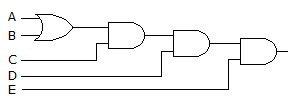
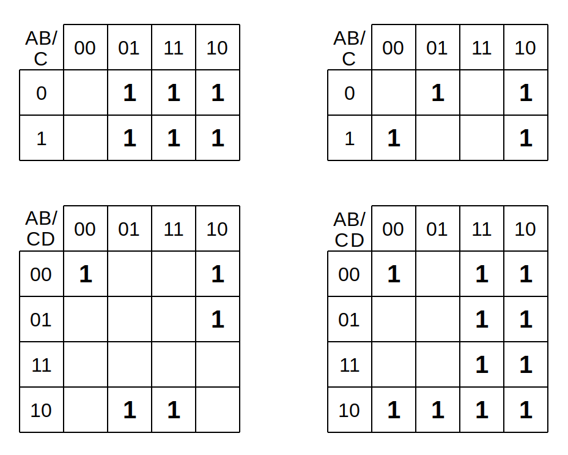

# Álgebra Booleana - 1

[{width=25} Versão para impressão.](https://github.com/Insper/Z01.1/raw/main/Exercicios/Exercicio-Algebra-Booleana-1.pdf)

!!! tip ""
    [:pencil: Resolução](https://github.com/Insper/Z01.1/blob/master/Exercicios/Exercicio-Algebra-Booleana-1-resolucao.pdf)

!!! exercise text short
    1. Indique o nome dos elementos lógicos a seguir:

    
    
    !!! answer
        and, nand, or, nor, xor, not

----------------

### Tabela verdade

!!! exercise text short
    A tabela verdade a seguir representa qual porta lógica?

    | A | B | OUT |
    |---|---|-----|
    | 0 | 0 |   0 |
    | 0 | 1 |   1 |
    | 1 | 0 |   1 |
    | 1 | 1 |   0 |
    
    !!! answer
        xor

!!! exercise text short
    A tabela verdade a seguir representa qual porta lógica?

    | A | B | OUT |
    |---|---|-----|
    | 0 | 0 |   1 |
    | 0 | 1 |   1 |
    | 1 | 0 |   1 |
    | 1 | 1 |   0 |
    
    !!! answer
        nand

----------------

### Aplicando a lei da Distributividade na expressão $A(B+\bar{C}+D)$ se tem:

1. $A . B + A . C + A . D$
1. $A . B . C . D$
1. $A + B + C + D$
1. $A B + A\bar{C} + A . D$

----------------

### Aplicando o teorema de DeMorgan na expressão $\overline{ABC}$, obtem:

1. $\bar{A}+\bar{B}+\bar{C}$

1. $\overline{A+B+C}$

1. $A + \bar{B} + C \bar{C}$

1. $A . (B+C)$

----------------

### Qual simplificação está incorreta:

1. $\overline{(\bar{x}+\bar{y})} = \bar{\bar{x}}*\bar{y} = x * \bar{y}$ 

2. $x ( \bar{x} + y ) = x . \bar{x} + x . y = 0 + x . y = x . y$

3. $x . y + x ( y + z ) = x . y + x . y + z = x . y + z$

4. $\bar{x} . \bar{y} . z + \bar{x} . y . z + x . \bar{y} = \bar{x} . z (\bar{y} + y) + x . \bar{y} = \bar{x} . z + x . \bar{y}$

----------------

### Qual forma canônica está correta?

 | **A** | **B** | **Q** |
 |-------|-------|-------|
 |     0 |     0 |     1 |
 |     0 |     1 |     0 |
 |     1 |     0 |     0 |
 |     1 |     1 |     1 |

1. $Q = A \bar{B} + A \bar{B}$

1. $Q = A+B * \bar{A} \bar{B}$

1. $Q = A . B$

1. $Q = \bar{A} . \bar{B} + A . B$

----------------

### Dado a seguinte tabela verdade (entradas A, B e C, e a saída Q):

 | **A** | **B** | **C** | **Q** |
 |-------|-------|-------|-------|
 |     0 |     0 |     0 |     1 |
 |     0 |     0 |     1 |     0 |
 |     0 |     1 |     0 |     0 |
 |     0 |     1 |     1 |     1 |
 |     1 |     0 |     0 |     1 |
 |     1 |     0 |     1 |     0 |
 |     1 |     1 |     0 |     0 |
 |     1 |     1 |     1 |     1 |

1. Crie uma fórmula em álgebra booleana que represente a tabela via SoP e PoS.

> SoP: Soma dos Produtos / PoS: Produto das Somas

1. Simplifique SoP (interprete o resultado!)

1. Desenhe um circuito usando os símbolos da álgebra booleana. 

----------------

### Quantas saídas com 1 existem na tabela verdade que resulta na seguinte fórmula de soma de produtos:

$A \bar{B} \bar{C} + \bar{A} B C + \bar{A} B \bar{C} + A \bar{B} \bar{C} + A B C$

----------------

### Qual é a expressão em álgebra booleana do seguinte circuito:

----------------

\newpage

### Gere a Tabela Verdade das equações a seguir:

- $A . B + \overline{B + A}$
- $A \oplus B$
- $(A and B) or C$

----------------

### Converta a seguinte expressão em Soma de Produtos para Produto de Somas:

$A . B . C + A \bar{B} \bar{C} + A . \bar{B} C + A . B . \bar{C} + \bar{A} . \bar{B} . C$

1. Faça a tabela verdade
1. Encontre o PoS

----------------

### Determine os valores de A, B, C e D que fazem a fórmula a seguir ser igual a zero (Z = 0).

 $Z = \bar{A} + B + \bar{C} + D$

----------------

### Qual das seguintes propriedades da álgebra booleana é falsa:

1. $A . (\bar{A} + B)= A . B$
1. $A + (A . B) = A$
1. $A + \bar{A} = 1$
1. $A . A = A$

----------------

### Simplifique a seguinte expressão:

$\bar{A} \bar{B} \bar{C} + \bar{A} B C + \bar{A} B \bar{C} + A \bar{B} \bar{C} + A B \bar{C}$

----------------

### Encontre as equações para os mapas de Karnaugh a seguir:

----------------

\newpage

### Crie o mapa de Karnaugh e encontre a equação da tabela verdade a seguir.

 | **A** | **B** | **C** | **OUT** |
 |-------|-------|-------|---------|
 |     0 |     0 |     0 |       1 |
 |     0 |     0 |     1 |       1 |
 |     0 |     1 |     0 |       0 |
 |     0 |     1 |     1 |       1 |
 |     1 |     0 |     0 |       0 |
 |     1 |     0 |     1 |       1 |
 |     1 |     1 |     0 |       0 |
 |     1 |     1 |     1 |       0 |

----------------

### Crie o mapa de Karnaugh da tabela verdade de quatro entradas.

 | **A** | **B** | **C** | **D** | **OUT** |
 |-------|-------|-------|-------|---------|
 |     0 |     0 |     0 |     0 |       0 |
 |     0 |     0 |     0 |     1 |       1 |
 |     0 |     0 |     1 |     0 |       0 |
 |     0 |     0 |     1 |     1 |       0 |
 |     0 |     1 |     0 |     0 |       0 |
 |     0 |     1 |     0 |     1 |       1 |
 |     0 |     1 |     1 |     0 |       0 |
 |     0 |     1 |     1 |     1 |       0 |
 |     1 |     0 |     0 |     0 |       0 |
 |     1 |     0 |     0 |     1 |       1 |
 |     1 |     0 |     1 |     0 |       1 |
 |     1 |     0 |     1 |     1 |       1 |
 |     1 |     1 |     0 |     0 |       0 |
 |     1 |     1 |     0 |     1 |       1 |
 |     1 |     1 |     1 |     0 |       0 |
 |     1 |     1 |     1 |     1 |       1 |

----------------

### Crie o mapa de Karnaugh para a expressão a seguir e simplifique:

$ABC\bar{D} + \bar{A}\bar{B}CD + A \bar{B}\bar{C}D + \bar{A} + \bar{B} + \bar{C} + \bar{D}$       

### A seguinte expressão foi resultado da forma canônica do produto de somas de uma tabela verdade para a produção de um circuito lógico. O objetivo é simplificar a álgebra booleana dessa lógica para o menor número possível de portas, porém visivelmente quem fez essa fórmula não percebeu que se tivesse feito a soma de produtos já partiria com um número menor de termos. Converta essa fórmula para a soma de produtos e minimize ela.

$(A+B+C)(A+B+\bar{C})(A+\bar{B}+C)(\bar{A}+B+C)(\bar{A}+\bar{B}+C)$

> dica: Equação -> tabela verdade -> soma dos produtos

----------------

Acabou? Os exercícios não param por aqui, tem a [parte 2!](/Z01.1/Exercicio-Algebra-Booleana-2)
