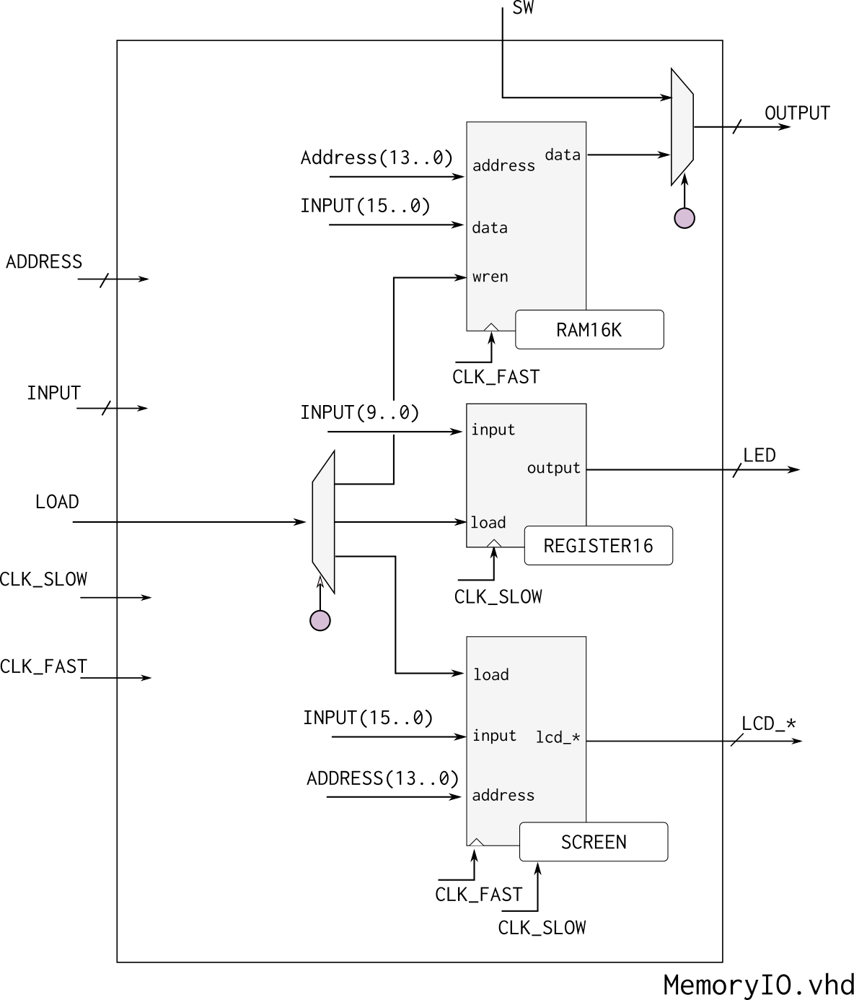

# Projeto

| Entrega      |
|--------------|
| 28/10 - Quinta |


Nesse projeto cada grupo terá que implementar sua própria CPU do Z01. 

## Começando

A seguir explicações de como começar o projeto.

### Entendendo a Organização do Projeto

A pasta do projeto F no repositório Z01, possui a seguinte estrutura:

```
F-Computador/
    testeHW.py
    testeAssemblyMyCPU.py
    Z01SimuladorMyCPU.py
    src/rtl/
    Quartus/
    Z01-Simulator-RTL/
```

1. `testeHW.py`: Testa o `controlUnit.vhd` e `memoryIO.vhd`
1. `testeAssemblyMyCPU.py`: Testa todo o HW do computador (`CPU.vhd`)
1. `Z01SimuladorMyCPU.py`: Abre o simulador gráfico do Z01.1 com o HW do grupo
1. `Z01-Simulator-RTL` : Pasta com o simulador do computador (usa o hardware criado por vocês)

### Testando HW (ControlUnit e MemoryIO)

Abra o terminal na pasta `F-CPU` e execute o script python localizado nessa pasta:

```bash
$ ./testeHW.py
```

!!! warning
    Esse script testa apenas uma pequena parte
    do Control Uniy e do MemoryIO!

    Passar nesse teste não indica 100% que o projeto está correto.

É possível testar apenas o controlUnit ou MemoryIO, execute o comando com: `lib.tb_controlunit.all` ou `lib.tb_memoryio.all` para testar apenas um módulo. 

```bash
$ ./testeHW.py lib.tb_memoryio.all 
$ ./testeHW.py lib.tb_controlunit.all
```

### Testando o projeto completo

Para testar se o computador está correto, iremos executar alguns programas realizados na etapa `E-Assembly` porém agora no Harware que vocês montaram. Para isso execute.

```bash
$ ./testeAssemblyMyCPU.py
```

Esse script irá compilar todos os módulos (desde o projeto C) e executar o top level `Computador.vhd`, iremos comparar se a resposta (memória RAM) possui o resultado esperado. Como os programas são complexos, esperamos com isso conseguir testar a totalidade do projeto.

!!! tip
    Temos uma página inteira detalhando como debugamos esse teste:
    
    - [Testando CPU](https://insper.github.io/Z01.1/cpu-Testando/)

### Actions

Adicione ao Actions os dois testes, separando o memoryIO e o controlUnit:

- `testeHW.py lib.tb_memoryio.all`
- `testeHW.py lib.tb_controlunit.all`
- `testeAssemblyMyCPU.py`

!!! tip
    No Actions você tem que colocar o caminho completo: `Projeto/F-Computador/...`


## Projeto

Deve-se implementar o `Control Unit` e integrar os módulos: `MemoryIO` e `CPU`. O HDL que descreve o `Computador` já foi fornecido pronto.

## Módulos 

!!! note
    Esses arquivos estão localizados em `F-Computador/src/rtl/`

Os módulos estão listados de maneira Top - Down

---------------------------
 
- Computador (==já está pronto! Não precisa mexer==, mas é legal ver!)
    - **Arquivo**: `computador.vhd`
    - **Descrição**: TopLevel do projeto, entidade que integra a memória ROM o MemoryIO, CPU e PLL
    - **Dependências**:
         - `Dispositivos/ROM/ROM32K.vhd`: ROM a ser utilizada no projeto (já foi dado pronto)
         - `Dispositivos/PLL/PLL.vhd`: PLL a ser utilizada no projeto (já foi dado pronto)
    
---------------------------

- MemoryIO
    - **Arquivo**   : `MemoryIO.vhd`
    - **Descrição** : Faz o mapa de memória para a CPU.
    - **Dependências** :
         - `Dispositivos/RAM/RAM16K.vhd` : RAM a ser utilizada no projeto (já foi dado pronto)
         - `Dispositivos/Screen/Screen.vhd` : Controlador do LCD a ser utilizada no projeto (já foi dado pronto)
    
---------------------------

- CPU
    - **Arquivo**   : `CPU.vhd`
    - **Descrição** : CPU do Z01 integra registradores, controlUnit, ULA e PC.
    - **Dependências** :
         - `ControlUnit.vhd` : Unidade de controle a ser implementada
         - `ULA.vhd` : Unidade lógica desenvolvida no projeto D
         - `PC.vhd` : Program counter do projeto E
         - `register16.vhd`, `mux16.vhd` : Componentes do projeto C e D 

---------------------------

- ControlUnit
    - **Arquivo**   : `ControlUnit.vhd`
    - **Descrição** : Unidade de controle da CPU do Z01.
    - **Dependências** :
         - não há 
         
### Diagramas 

---------------------------



---------------------------

{width=400}

---------------------------

## Rubrica do projeto

!!! warning
    Os conceitos B e A devem ser feitos em um outro branch!
    
    - `git checkout -B CPU-Extras`

| Conceito |                                                                                     |
|----------|-------------------------------------------------------------------------------------|
| I        |  Menos da metade dos módulos funcionando                                           |
|          |                                                                                    |
| D        |  Ao menos um módulo não está feito e não passa no testes.                          |
|          |                                                                                    |
| C        |  Construiu com os módulos do grupo o seu próprio computador                        |
|          |  Todos os módulos sendo testados no Actions.                                        |
|          |  Todos os módulos passam nos testes.                                               |
|          |                                                                                    |
| B        |  Adiciona um novo registrador a CPU  (`%S`)                                        |
|          | ~~Adiciona os displays de Sete Segmentos aos periféricos do Computador (memoryIO)~~ |
|          |  Modifica os testes para testar esse novo recurso!                                 |
|          |                                                                                    |
| A        |  Possibilita realizar carregamento efetivo em %D (`leaw $5, %D`)                   |
|          |  Modifica os testes para testar esse novo recurso!                                 |


### Formulários
 - [Scrum Master](https://docs.google.com/forms/d/e/1FAIpQLSfbnCZlGCKQLQnABFJhxhkG6vcH2HLP7ukIG0s9bhO5_M31kw/viewform?usp=sf_link)
 - [Desenvolvedores](https://docs.google.com/forms/d/e/1FAIpQLSduO77Uzt0i8weuF1Jj-9T2dY868zRn_FWT4HdgE7dNf_VT4w/viewform?usp=sf_link)


